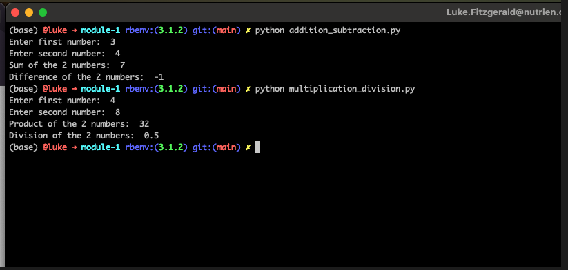

To run either of the 2 files in this directory, simply use the python command, followed by the filename:
`python addition_subtraction.py`
OR
`python multiplication_division.py`

You will be prompted to enter 2 numbers, and will then see the results of the math functions applied to those 2 numbers outputted:

