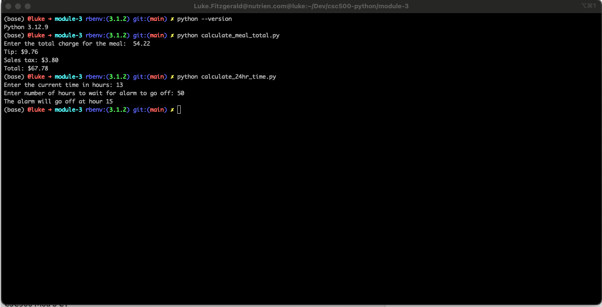

# Module 3

Using python 3.12.9

To run either of the 2 files in this directory, simply use the python command, followed by the filename:
`python calculate_meal_total.py`
OR
`python calculate_24hr_time.py`

For the first program, you will be asked to enter a number that represents the total cost of a meal, and you will see the tip amount, the tax amount, and the total amount outputted

For the second program, you will be asked to enter a value for the current time (in hours), and then the number of hours to wait for your alarm to go off. The program will then output the time your alarm will go off. 

