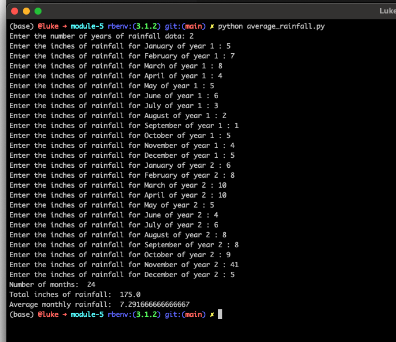
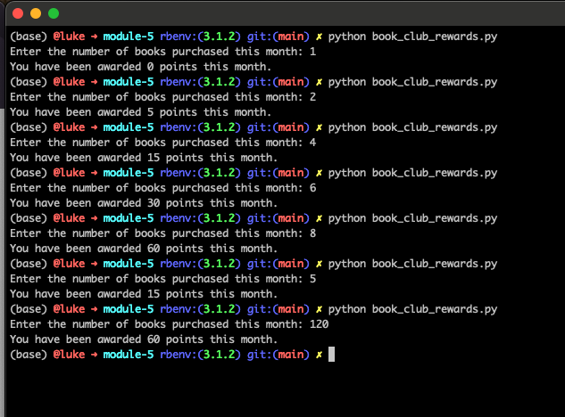

# Module 5 - Critical Thinking Assignment

Using python 3.12.9

The first program collects rainfall data for however many years the user wants to input it for. To execute it, run `python average_rainfall.py`. You will first be asked to input the number of years of rainfall data to evaluate, and then you will be prompted to enter in the rainfall amount (in inches) for each month of each year. Once you have completed entering in all of the data, the number of months, total rainfall, and average monthly rainfall will be outputted. 

The second program will request the number of books a user has purchased for the current month, and then display how many reward points they have received. To execute it, run `python book_club_rewards.py`. 

