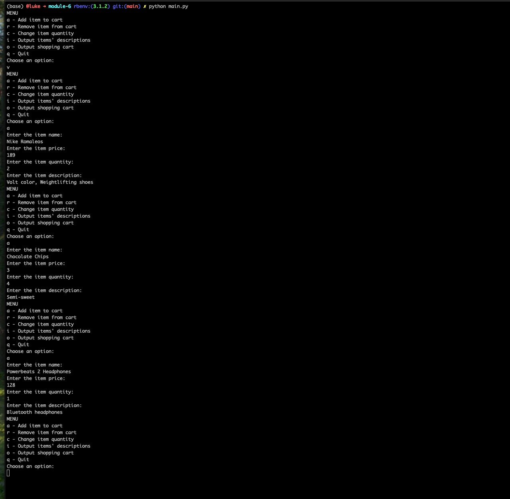
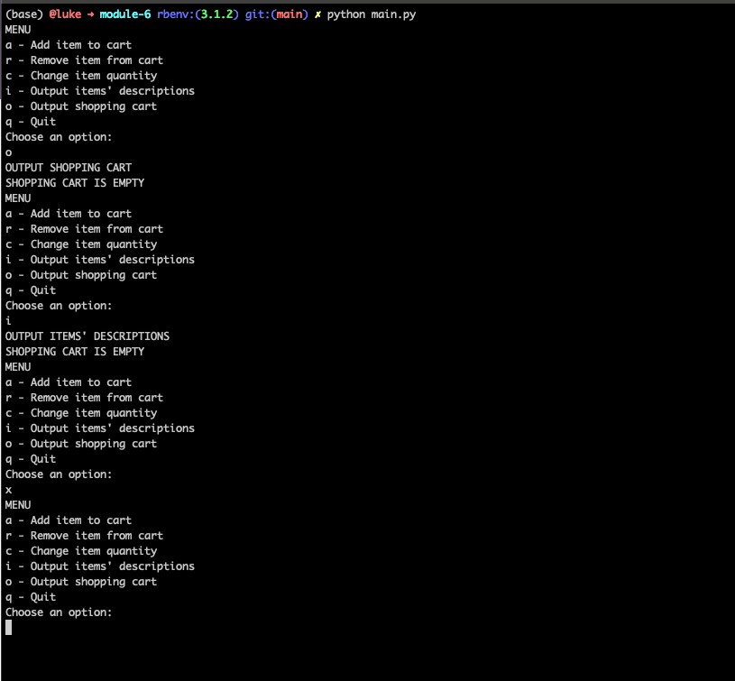
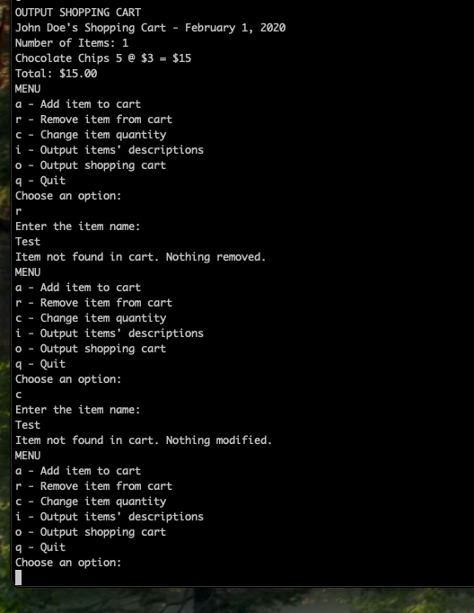
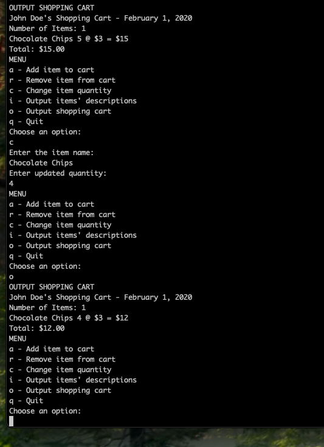
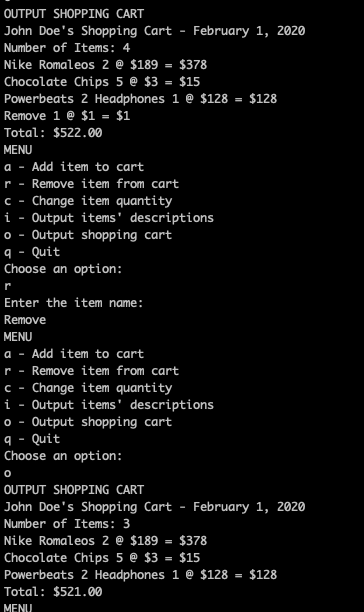
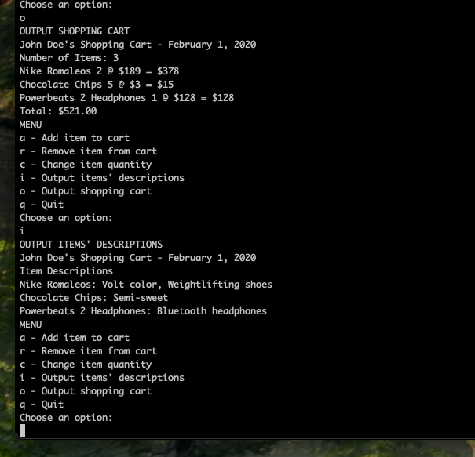

# Module 6 - Portfolio Milestone

Using python 3.12.9

Adding items to the cart:

Empty Cart / Invalid Character Entered:

Item Not Found In Cart:

Update Item Quantity

Remove Item from Cart

Output Shopping Cart and Product Descriptions

