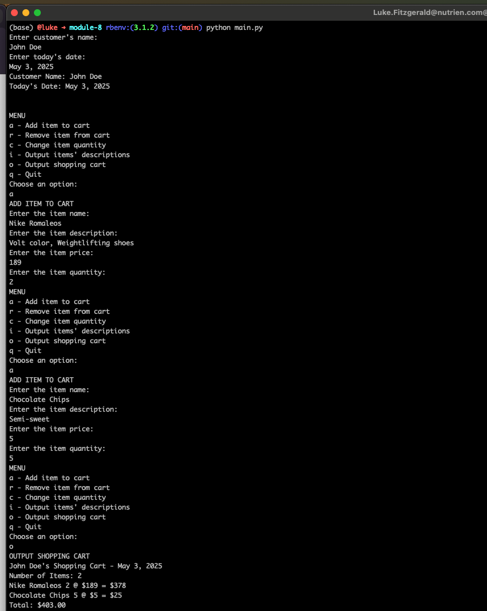

# Module 8 - Portfolio Project

Using python 3.12.9

Prompt the user for the user's name and today's date, then output that information to the console and display the Menu options. Here, we added 2 products to the cart, which can be seen in the cart's output at the bottom of the image. 

Removing an item from the cart. We can see that the item was successfully removed when we output the cart's contents after removal.

Updating the qty of the product "Nike Romaleos" from 2 to 3. This can be confirmed by outputting the cart's contents. 

